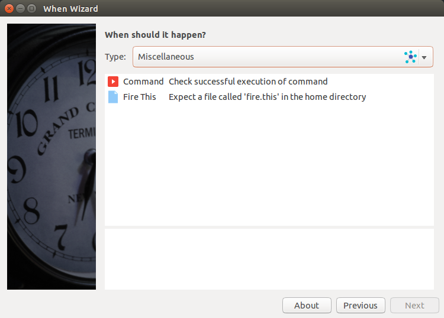
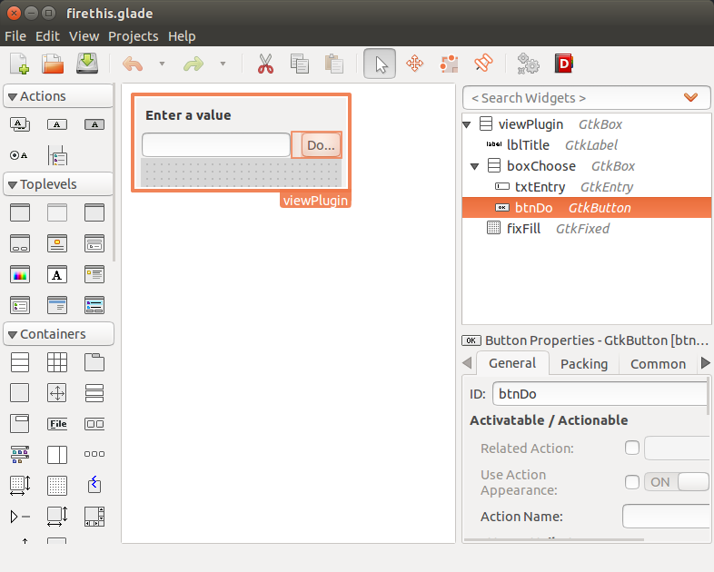
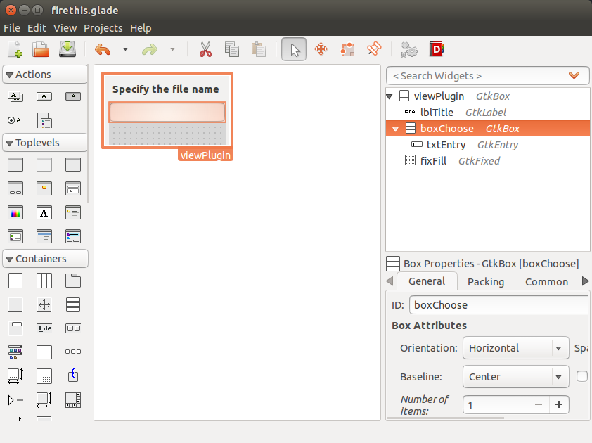
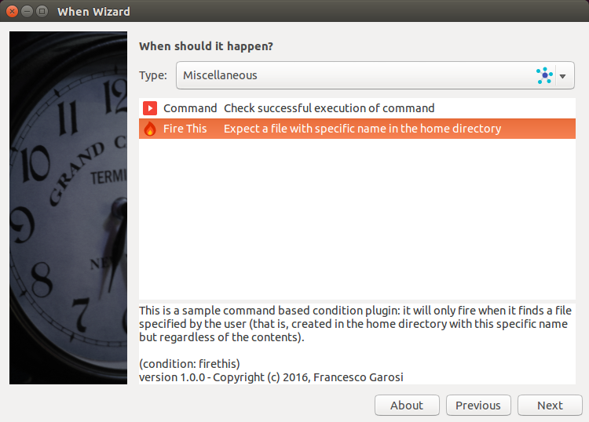
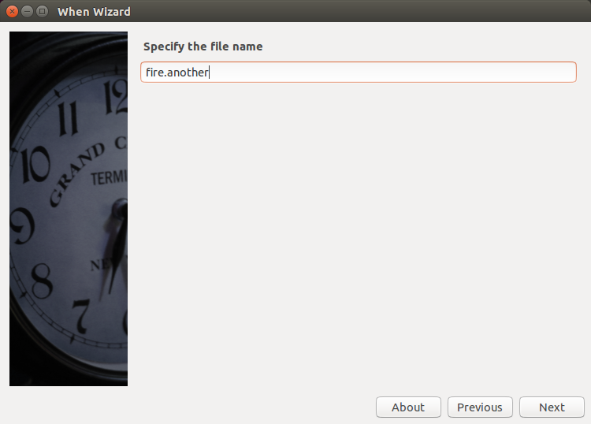
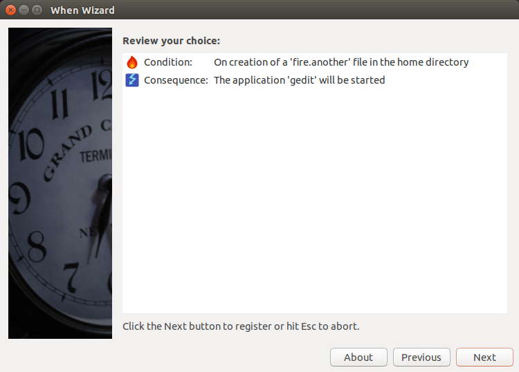

===============
The When Wizard
===============

The **When Wizard** aims at becoming, possibly, the main interface to
**When** for those users who just want to instruct their workstations to
perform simpler tasks on a rich subset of the available conditions, or for
those system administrators who want to provide standardized sets of tasks
and events or conditions that may trigger such tasks. The **When Wizard**
is available (in *early development* stage) at its own repository_.

The **When Wizard** has been designed for extensibility: it is completely
based on plugins that are loaded by a small application core. Some plugins
are provided by default (I call them *stock plugins*), others may be
developed and easily added to the application.

.. Warning::
  The **When Wizard** is still in its early development stages, and this
  means at least that its API is still subject to changes. Such changes
  are expected to be drastically reduced before it reachs a *beta* status,
  but for now things could change abruptly, even on a convenience basis.

The main entry point for **When Wizard** extension is *plugin development*.
*Plugins* are the parts, in the application, that actually *define* items
in **When**, while the surrounding application only provides the wizard
interface and the steps that actually communicate with **When** to create
the items. Communication with **When** is made possible mainly via the
*DBus Remote API* later discussed in this manual.

There are two types of plugins that can be developed:

  * *task* plugins, and
  * *condition* plugins

even though in the latter case there are subtypes, one of which has to be
chosen when developing a *condition* plugin. *Task* plugins are probably
the ones that would gain more attention, because there are virtually
infinite tasks that can be defined to ease the user's life. But also some
types of conditions can be added as shortcuts to more complex ones:

* conditions that check *system commands*, and
* conditions that react to *user defined events*, for which the user event
  definition could be provided as an *Item Definition File*.

The following paragraphs will illustrate briefly how a plugin for the
**When Wizard** can be implemented.

.. _repository: https://github.com/almostearthling/when-wizard.git

Plugin Rationale
================

The idea behind the plugin-based structure is that it's almost impossible
to implement (or try to implement) all available reactions to all available
events, and probably also just the features that most users would like to
see are quite difficult to find and to blend with a possibly closed or
monolithic environment. Thus the plugin system: also basic functionality
is implemented as plugins in the **When Wizard**, and the system will
dynamically look for plugins both in common areas and in the user home,
making it easier to install functionality on a per-user basis.

Plugins are essentially *Python 3.x* modules with a structure, and should
obey some simple rules:

1. each plugin module *must* export a class named ``Plugin`` derived from
   either ``TaskPlugin`` or from one of the base ``...ConditionPlugin``
   classes
2. the derived class must initialize some class parameters through the
   base class constructor: many of these parameters are there for
   classification and documentation purposes only, but they end up being
   useful for a correct representation of the plugin functionality in the
   UI of the **When Wizard**
3. plugins may or may not allow for configuration in the wizard interface,
   but if they do they have to export their configuration pane through a
   well-defined interface
4. plugins should document what they do after configuration (if any) in a
   way that summarizes their purpose after configuration.

In fact all of this can lead to a plugin that does everything it has to do
just via its constructor. In many cases the plugin will sport a configuration
pane and signal functions for controls in the configuration pane, that update
the inner variables and construct the values required by the underlying task
or condition. Templates are provided for base plugins, because the plugin
structures tend to be very similar to each other, so that the coding effort
can be reduced to the bare minimum.

.. Note::
  To facilitate development of plugins, a recommended method is provided that
  allows easier testing and packaging, and that consists in the creation of a
  specific directory where *all* plugin files are located: the plugin source
  file, its auxiliary (executable) scripts, the custom icon [#customicon]_
  file, other graphic files if needed, and the configuration pane resource
  file -- whose extension must be either ``.ui`` or ``.glade``. To test the
  plugin in the **When Wizard** in such an environment, it is sufficient to
  define an environment variable, ``WHEN_WIZARD_DEVPLUGIN``, to point to the
  absolute path where the plugin files are found. In this way both the
  wizard and the manager will look for the plugin and its related files in
  that directory before trying the actual plugin directories.

Reserved Attributes
===================

Instead of building a complex suite of private members and getters/setters
for base class properties, the quick approach has been chosen to directly
expose some values to the derived classes through member variables. There
are thus two types of attributes with special meanings -- which doesn't
mean that they shouldn't be accessed or changed: in some cases they *must*
be updated -- that is:

- special member variables, and
- special methods.

Most special member variables are defined at initialization time, with the
appropriate base constructor parameter:

===================== ========================================================
Variable/Parameter    Description
===================== ========================================================
category              the plugin category, must be one of the values defined
                      in ``PLUGIN_CONST`` (usually explicitly imported from
                      the ``plugin`` module): it's available only for *task*
                      plugins as a constructor parameter [#categorymod]_
basename              the base name of the plugin, should correspond to the
                      base name of the plugin file
name                  a descriptive name for the plugin, to be kept short
description           a short description of the plugin
author                the name of the plugin author
copyright             the usual copyright string, with year and so on
icon                  the name of the icon: should correspond to the base
                      name of a *PNG* file without extension either in the
                      application resource directory or in the user resource
                      directory
help_string           a sufficiently long help string: will appear in the
                      wizard box to document what the plugin does; it should
                      not exceed about four lines of text, all newlines are
                      converted to spaces.
version               a possibly sortable version string
===================== ========================================================

The values set here are available for reading withinthe plugin class in case
of need -- for example, to derive the base name of another file, such as an
icon or resource file.

There are other reserved variable names: ``unique_id``, ``module_basename``,
``module_path``, ``stock``, ``plugin_type``, ``summary_description``,
``forward_allowed``, ``scripts``, ``resources`` and ``graphics``.
Some are used internally, but the following ones should be assigned or
modified in the derived class to change the behavior of the plugin and to
allow the plugin to be correctly installed or removed:

* ``summary_description`` must be given an explanatory value that will be
  shown in the summary page of the wizard; it can be modified while the
  plugin is being configured and can contain values of the configuration
  parameters
* ``forward_allowed`` should be set to ``False`` in the derived plugin
  constructor if the default values for its parameters (that is, the ones
  that will be first shown in the configuration pane) *must* be modified
  before the wizard can step forward; if it's set to ``False``, then the
  ``allow_forward()`` method shown below must be used to enable the *Next*
  button
* ``scripts`` can contain the list of script files (basenames only) that
  are used by the plugin: such scripts must be executable and available in
  the plugin development directory; the recommended way to update this
  variable (and the next two) is via ``self.scripts.append('filename.ext')``
* ``resources`` can contain the list of resource files (basenames only)
  used by the plugin: normally it only contains the ``.glade`` (or ``.ui``)
  file that defines the configuration pane, if needed; these files too must
  be available in the plugin development directory
* ``graphics`` must contain the list of graphic files (basenames only) that
  are used by the plugin, including the plugin icon file (whose basename
  without extension is specified in the base constructor call) if a custom
  icon is used; same as above for where the graphic files must be located.

.. Warning::
  The **When Wizard** installer does not check whether or not a plugin file
  name or the names of its auxiliary files are already taken: if so, a newly
  installed plugin may overwrite other installed plugins, although never the
  ones that come with the application, or parts of them. It is advisable to
  use very specific names for plugins, and that the auxiliary files have the
  same name (except for the extension) at least as a prefix.

All plugins have these methods:

===================== ========================================================
Method                Description
===================== ========================================================
get_dialog(name)      returns a `dialog builder`_ object from a file that has
                      the base name (without extension: supported extensions
                      are ``.ui`` and ``.glade``) as the provided parameter
get_image(name)       returns a `pixbuf` loaded from a file whose base name
                      is the provided parameter; icons are looked for in two
                      paths: the user resource path and the application
                      resource path, so that a non-stock plugin can also use
                      one of the icons that come with the application
get_script(filename)  returns the full path to an executable script if it is
                      needed by the plugin either to execute an action or to
                      test a condition; the filename should be the base name
                      only, including any extension (like ``.py`` or ``.sh``)
allow_forward()       if called without arguments (or with ``True`` as
                      argument) it causes the wizard button to become
                      *sensitive*: it has to be called when the configuration
                      pane controls contain acceptable data; if a ``False``
                      parameter is provided, the wizard button will become
                      *not sensitive*
get_pane()            if the plugin has a configuration pane, this method
                      *must* be overridden and return a reference to the
                      outmost container object in the plugin pane dialog
                      structure.
===================== ========================================================

There are also other reserved method names common to all pugins: ``to_dict``,
``from_dict``, ``to_item_dict``, ``to_itemdef_dict``, ``to_itemdef``,
``desc_string_gui``, ``desc_string_console``, ``data_store``,
``data_retrieve``, ``set_forward_button``, and ``get_config``. These names
should not be overridden in plugin implementations as overriding them would
cause the plugin not to work properly.

.. _`dialog builder`: https://python-gtk-3-tutorial.readthedocs.org/en/latest/builder.html

Task Plugins
============

Task plugins should just provide a *command line* that will be run whenever
the associated condition occurs. The easiest case is when the command is
fixed and no configuration is needed: in such a case the constructor will
define the command and no other code is needed. For example, the command to
lock a session is

::

  $ dm-tool lock

with no configurable options. This means that a plugin whose task is to lock
the running session will only configure the ``command_line`` member variable
of the task plugin to be ``dm-tool lock``.

The variables that can be set in a task plugin to modify its behavior are the
following:

================= ============================================================
Variable          Description
================= ============================================================
command_line      the command that will be executed by the task in its
                  entirety, including parameters: it will be executed in a
                  shell, so it can also be the path to a script
process_wait      determine whether or not the calling process should wait
                  for the called process to end; for simple tasks it is
                  safe to skip this and let the process be left alone as
                  soon as it is started
================= ============================================================

In case a task plugin should be configured, the ``get_pane()`` method must be
overridden to return a reference to the outmost container of the configuration
pane, and dialog signal handling functions must be defined to retrieve
configuration values from the pane just as if it were a standard *Gtk* dialog
box.

Task plugins also give the possibility to set one and only one of the
following variables:

=============== ==============================================================
Variable        Description
=============== ==============================================================
success_status  if the status code of the called process has to be checked
                for a specific success value; must be an integer and
                defaults to ``0``
failure_status  if the status code of the called process has to be checked
                for a specific failure value; must be an integer
success_stdout  a string that, if corresponding to process output (written
                to *stdout*), will let the process execution be considered
                a success; modifiers specified below can change the way the
                correspondance is checked
failure_stdout  a string that, if corresponding to process output (written
                to *stdout*), will let the process execution be considered
                a failure; same as above for modifiers
success_stderr  string that, if corresponding to process output (written
                to *stderr*), will let the process execution be considered
                a success; same as above for modifiers
failure_stderr  a string that, if corresponding to process output (written
                to *stderr*), will let the process execution be considered
                a failure; same as above for modifiers
=============== ==============================================================

and these are the modifiers for string *stdout/stderr* variables:

===================== ========================================================
Variable              Description
===================== ========================================================
match_exact_output    if the specified string should match from start to end,
                      if ``False`` the correspondance will be found when the
                      given string is contained in the output
match_case_sensitive  if ``True`` the comparison is case sensitive
match_regexp          if ``True`` the given string is considered a regular
                      expression and matched against the process output
===================== ========================================================

These attributes are all booleans, and default to ``False``: output will be
searched for a substring with no distinction between uppercase and lowercase.
Values for the modifier variables can be set independently on all of them:
for example if ``match_exact_output`` is set to ``True`` and ``match_regexp``
too, the provided regular expression will be checked at the beginning of the
process output, if ``match_exact_output`` is ``False`` **When** will just try
to find a match for the regular expression in the output.

The base class for this type of plugin is ``TaskPlugin``: at the beginning
of a plugin there must always be the following statement

.. code-block:: python

  from plugin import TaskPlugin, PLUGIN_CONST

in order to derive the ``Plugin`` class. [#pluginnameimport]_ The above
mentioned ``category`` base constructor parameter can be given one of the
following values:

=================================== ==========================================
Constant                            Related plugins
=================================== ==========================================
PLUGIN_CONST.CATEGORY_TASK_APPS     For plugins that concern applications,
                                    such as starting or killing a program or
                                    system utility
PLUGIN_CONST.CATEGORY_TASK_SETTINGS When the plugin manages session, desktop
                                    or system settings
PLUGIN_CONST.CATEGORY_TASK_POWER    For power-management related plugins
PLUGIN_CONST.CATEGORY_TASK_SESSION  For session management related plugins,
                                    like session lock, unlock or logout
PLUGIN_CONST.CATEGORY_TASK_FILEOPS  This has to be used for plugins that
                                    perform file operation, such as backups
                                    or synchronizations
PLUGIN_CONST.CATEGORY_TASK_MISC     All other task plugins belong here
=================================== ==========================================

These values should be assigned carefully, because the user will be able to
choose a plugin only after category has been selected.

Condition Plugins
=================

There are several types of condition plugins: for each type the appropriate
base class must be used. In the same way as for task plugins, the base class
be imported in the plugin code:

.. code-block:: python

  from plugin import <SpecificConditionPlugin>, PLUGIN_CONST

where ``<SpecificConditionPlugin>`` must be replaced with one of the names
specified below. The plugin category is determined by the condition plugin
type, but in case the developed plugin belongs to a different category, its
value can be assigned one of the following constants:

================================= ============================================
Constant                          Related plugins
================================= ============================================
PLUGIN_CONST.CATEGORY_COND_TIME   Category for plugins that define conditions
                                  concerning time: *time*, *idle time*, and
                                  *interval* based conditions normally belong
                                  to this category
PLUGIN_CONST.CATEGORY_COND_EVENT  Category for plugins that define conditions
                                  related to stock and user defined *events*
PLUGIN_CONST.CATEGORY_COND_MISC   All other condition plugins belong here
================================= ============================================

The ``category`` member variable can be reassigned *after* the base class
constructor has been called -- otherwise the new category is overwritten.

Just like task plugins, condition plugins must offer a ``get_pane()`` method
that returns a reference to the outermost container object in case they
need any configuration.

There are some *flags* (in the form of attributes, as usual) that can be set
to either ``True`` or ``False`` to change how the generated condition check
will behave:

================= ============================================================
Variable          Description
================= ============================================================
sequential        if there is a task list instead of a single associated task
                  the tasks in the list are run sequentially; since the
                  application only provides conditions associated with single
                  tasks this flag can be left alone; set to ``True`` by
                  default
repeat            if ``True`` checks will persist after first successful one
suspended         if ``True`` then checks for the associated condition are
                  suspended on condition registration
break_on_failure  when a sequence of tasks is given, break after the first
                  failed task; normally it is ignored, and defaults to
                  ``False``
break_on_success  when a sequence of tasks is given, break after the first
                  successful task; normally it is ignored, and defaults to
                  ``False``
================= ============================================================

Other attributes, methods and other member data may be present in subclasses
that can be derived from, as specifically described below.

Interval Based Condition Plugins
--------------------------------

Such plugins must provide the length of an interval in minutes, in the
``interval`` member variable. A simple plugin of this kind is already
provided by the application and derivatives are unlikely to be actually
useful.

The base class for this type of plugin is ``IntervalConditionPlugin``.

Time Based Condition Plugins
----------------------------

Plugins of this type must define a time specification dictionary in the
``timespec`` member variable: the dictionary values are integers, with the
following keys (as strings):

* ``'year'``
* ``'month'``
* ``'day'``
* ``'hour'``
* ``'minute'``
* ``'weekday'``

The ``'weekday'`` key, if used, allows for week-based repetition. A value
of ``0`` is for monday, ``6`` is for sunday. It should not be used in
conjunction with other date specifications. Values that must not be checked
can just be skipped: for a condition that must occur at quarter past any
hour of the day, just

.. code-block:: python

  self.timespec['minute'] = 15

should be set in the plugin. Instead of providing a single plugin of this
type with all possible settings, several plugins with more specific scope
can be a better option to give the users an easier way to choose what kind
of time based condition they need.

The base class for this type of plugin is ``TimeConditionPlugin``.

Idle Time Based Condition Plugins
---------------------------------

In this type of plugin the ``idlemins`` member variable must contain the
time in minutes that the session has to be idle before the condition occurs;
since a simple plugin of this kind is already provided, this one is unlikely
to be derived.

The base class for this type of plugin is ``IdleConditionPlugin``.

File Change Based Condition Plugins
-----------------------------------

In these a path containing a file or directory to be watched must be provided
using the ``watched_path`` string member variable. Stock plugins, one for
files and another one for directories, are already available.

The base class for this type of plugin is ``FileChangeConditionPlugin``.

Stock Event Based Condition Plugins
-----------------------------------

These plugins provide the counterpart of the *Event Based Conditions* in the
**When** applet, and only occur when stock events occur. They must hold the
event name in the ``event`` member variable, and are unlikely to need any
form of configuration. However plugins for stock events are provided by the
application, the only exception being possibly command line driven events,
which are virtually useless in the **When Wizard** context.

The base class for this type of plugin is ``EventConditionPlugin``.

User-Defined Event Based Condition Plugins
------------------------------------------

Plugins of this kind must store the name of the user-defined event (as known
by **When**, thus the name that has been possibly given to the event in an
*Item Definition File*) in the ``event_name`` member variable. These can be
very useful to create condition that occur on events that are not handled by
**When** by default, and the possibilities are virtually endless.

Because the corresponding conditions occur when the related *DBus* signal is
fired, in most cases the related plugins will need no configuration pane.

The base class for this type of plugin is ``UserEventConditionPlugin``.

Command Based Condition Plugins
-------------------------------

Command based conditions are probably the ones that will benefit most from
the implementation of specific plugins: almost every check can be done
using system commands, possibly combined into scripts, and many types of
event can be discovered or triggered in this way.

Such conditions are possibly where **When** can show the highest flexibility,
but are also the ones that require a certain knowledge of Linux, of the
shell and the system commands, and that might require some programming
skills. The ability to include scripts with the plugin and the possibility
to modify the command line using data gathered through the pane-based
configuration gives the possibility to check for whatever actual status of
the system -- from the availability of files or devices to the connection
status or the existence of resources online, just to mention a few.

Plugins of this type must store the actual command line in the
``command_line`` member variable, and depending on the command result the
related event will either occur or not.

Just like in `Task Plugins`_ there are attributes to check command outcome:
since there is no concept of success or failure in conditions, but just
either occurrence or not, the attributes only specify what to expect.

=============== ==============================================================
Variable        Description
=============== ==============================================================
expected_status the status that the called process should return to consider
                the underlying condition to occur; it must be integer and by
                default it is set to ``0``
expected_stdout string to find a correspondence for in the *standard output*
expected_stderr string to find a correspondence for in the *standard error*
=============== ==============================================================

Here too modifiers are available, as for *Task Plugins*, and have the same
identifiers and specifications:

===================== ========================================================
Variable              Description
===================== ========================================================
match_exact_output    if the specified string should match from start to end,
                      if ``False`` the correspondance will be found when the
                      given string is contained in the output
match_case_sensitive  if ``True`` the comparison is case sensitive
match_regexp          if ``True`` the given string is considered a regular
                      expression and matched against the process output
===================== ========================================================

Sae as above, the modifiers are all set to ``False`` by default.

The base class for this type of plugin is ``CommandConditionPlugin``.

Plugin Packaging and Installation
=================================

The **When Wizard** suite contains a simple utility to package plugins for
installation. It can be invoked as follows:

::

  $ when-wizard plugin-package <directory_name>

where ``<directory_name>`` is the name of the directory where the plugin is
being developed. The utility is very basic, and just creates an archive with
a name of the form ``plugin-basename.1433e3da13d9f700.wwpz``: the middle
part is just some hexadecimal blurb to make the name as unique as possible,
and the package can be safely renamed after creation, apart from the
``.wwpz`` extension. The packaged plugin can be installed from the command
line by issuing

::

  $ when-wizard plugin-install [/path/to/]plugin_archive_file.wwpz

where ``[/path/to/]plugin_archive_file.wwpz`` is the file name of a packaged
plugin, possibly including the path if needed.

Write a Simple Plugin
=====================

This section illustrates how to write a simple plugin for the **When Wizard**.
First a command-based condition plugin is created that needs no configuration
as it only does a fixed thing. Then the plugin will be expanded in order to
be configurable and thus expose a configuration pane that will be shown in
the wizard interface.

Step 1: Preparation
-------------------

Preparation is quite easy: a directory for the plugin is needed as well as
some source files to start from. These files can be found in the *share*
directory where **When Wizard** is installed: assuming that the application
is installed canonically in ``/usr/bin``, the directory where the development
templates are is ``/usr/share/when-wizard/templates/``. For a condition
plugin based on command execution, the template code is in the file called
``template-cond-command.py``. Thus, assuming that the plugin will be called
*Fire This*:

::

  ~$ mkdir firethis
  ~$ cd firethis
  ~/firethis$ cp /usr/share/when-wizard/templates/template-cond-command.py .
  ~/firethis$ mv template-cond-command.py firethis.py

And this is all for preparation. There is still a lot to do, though.

Step 2. Change the Plugin Code
------------------------------

This is what the template code looks like:

.. code-block:: python

  # file: share/when-wizard/templates/template-cond-command-plugin.py
  # -*- coding: utf-8 -*-
  #
  # Template for a command based condition plugin
  # Copyright (c) 2015-2016 Francesco Garosi
  # Released under the BSD License (see LICENSE file)

  import locale
  from plugin import CommandConditionPlugin, PLUGIN_CONST, plugin_name

  # Gtk might be needed: uncomment if this is the case
  # from gi.repository import Gtk

  # setup localization for both plugin text and configuration pane
  # locale.setlocale(locale.LC_ALL, locale.getlocale())
  # locale.bindtextdomain(APP_NAME, APP_LOCALE_FOLDER)
  # locale.textdomain(APP_NAME)
  # _ = locale.gettext

  # if localization is supported, uncomment the lines above configure
  # them as appropriate, and remove this replacement function
  def _(x):
      return x

  HELP = _("""\
  This is a template for a generic command condition plugin: it can be expanded
  suitably to the needs of the plugin. A command line based condition plugin
  must provide the full command line to be executed for the condition to be
  verified: if the command is successful (zero-status) the condition is true.
  """)

  # class for a plugin: the derived class name should always be Plugin
  class Plugin(CommandConditionPlugin):

      def __init__(self):
          CommandConditionPlugin.__init__(
              self,
              basename=plugin_name(__file__),
              name=_("Template"),
              description=_("Explain here what it does"),
              author="John Smith",
              copyright="Copyright (c) 2016",
              icon='puzzle',
              help_string=HELP,
              version="0.1.0",
          )
          # the icon resource is only needed if the plugin uses a custom icon
          # self.graphics.append('plugin_icon.png')

          # the items below might be not needed and can be deleted if the
          # plugin does not have a configuration panel
          self.resources.append('plugin_template.glade')
          self.builder = self.get_dialog('plugin_template')
          self.plugin_panel = None
          self.forward_allowed = False        # forward not enabled by default

          # define this only if the plugin provides one or more scripts
          # self.scripts.append('needed_script.sh')

          # mandatory or anyway structural variables and object values follow:
          self.command_line = None            # full command line to run
          self.summary_description = None     # must be set for all plugins

          # this variable is defined here only for demonstrational purposes
          self.value = None

      def get_pane(self):
          if self.plugin_panel is None:
              o = self.builder.get_object
              self.plugin_panel = o('viewPlugin')
              self.builder.connect_signals(self)
          return self.plugin_panel

      # all following methods are optional

      def click_btnDo(self, obj):
          o = self.builder.get_object
          o('txtEntry').set_text("Some text")

      def change_entry(self, obj):
          o = self.builder.get_object
          self.value = o('txtEntry').get_text()
          if self.value:
              self.summary_description = _(
                  "Something will be done with %s") % self.value
              self.allow_forward(True)
          else:
              self.summary_description = None
              self.allow_forward(False)

  # end.

There is a lot of code that is not needed, because the plugin will display
no configuration pane and will not use custom resources, not even graphics.
However, since further development is planned, it might be better just to
comment out at least part of the code that is not needed for now, especially
the configuration pane related functions. As no scripts will be used, the
two lines about scripts will be removed, as well as localization lines and
the commented out import of the *Gtk* library. Here is the result:

.. code-block:: python

  # file: share/when-wizard/templates/template-cond-command-plugin.py
  # -*- coding: utf-8 -*-
  #
  # Template for a command based condition plugin
  # Copyright (c) 2015-2016 Francesco Garosi
  # Released under the BSD License (see LICENSE file)

  from plugin import CommandConditionPlugin, PLUGIN_CONST, plugin_name

  # if localization is supported, uncomment the lines above configure
  # them as appropriate, and remove this replacement function
  def _(x):
      return x

  HELP = _("""\
  This is a template for a generic command condition plugin: it can be expanded
  suitably to the needs of the plugin. A command line based condition plugin
  must provide the full command line to be executed for the condition to be
  verified: if the command is successful (zero-status) the condition is true.
  """)

  # class for a plugin: the derived class name should always be Plugin
  class Plugin(CommandConditionPlugin):

      def __init__(self):
          CommandConditionPlugin.__init__(
              self,
              basename=plugin_name(__file__),
              name=_("Template"),
              description=_("Explain here what it does"),
              author="John Smith",
              copyright="Copyright (c) 2016",
              icon='puzzle',
              help_string=HELP,
              version="0.1.0",
          )
          # the icon resource is only needed if the plugin uses a custom icon
          # self.graphics.append('plugin_icon.png')

          # the items below might be not needed and can be deleted if the
          # plugin does not have a configuration panel
          # self.resources.append('plugin_template.glade')
          # self.builder = self.get_dialog('plugin_template')
          # self.plugin_panel = None
          # self.forward_allowed = False        # forward not enabled by default

          # mandatory or anyway structural variables and object values follow:
          self.command_line = None            # full command line to run
          self.summary_description = None     # must be set for all plugins

          # this variable is defined here only for demonstrational purposes
          # self.value = None

      # def get_pane(self):
      #     if self.plugin_panel is None:
      #         o = self.builder.get_object
      #         self.plugin_panel = o('viewPlugin')
      #         self.builder.connect_signals(self)
      #     return self.plugin_panel

      # all following methods are optional

      # def click_btnDo(self, obj):
      #     o = self.builder.get_object
      #     o('txtEntry').set_text("Some text")

      # def change_entry(self, obj):
      #     o = self.builder.get_object
      #     self.value = o('txtEntry').get_text()
      #     if self.value:
      #         self.summary_description = _(
      #             "Something will be done with %s") % self.value
      #         self.allow_forward(True)
      #     else:
      #         self.summary_description = None
      #         self.allow_forward(False)

  # end.

which looks definitely simpler. Some paperwork is needed for the plugin to
work, so the "anagraphic" details have to be defined. This is done via the
invocation of the base constructor:

.. code-block:: python

      def __init__(self):
          CommandConditionPlugin.__init__(
              self,
              basename=plugin_name(__file__),
              name=_("Fire This"),
              description=_("Expect a file called 'fire.this' in the home directory"),
              author="Francesco Garosi",
              copyright="Copyright (c) 2016",
              icon='file',
              help_string=HELP,
              version="1.0.0",
          )

The ``icon`` parameter has been changed to ``file`` because in the stock
icons directory (all of which are kindly provided by icons8_ under the
`Good Boy License`_) [#iloveicons8]_ there is a ``file.png`` icon, which
is more suitable than the *puzzle* default icon. However it is still not
the best option for this plugin, and it may change in further development.
Also, the long help string has to be changed into something helpful, like

.. code-block:: python

  HELP = _("""\
  This is a sample command based condition plugin: it will only fire when it
  finds a file called ~/fire.this (that is, created in the home directory
  with this specific name but regardless of the contents).
  """)

Next, the only needed features are:

* a command line
* some text that would explain what the plugin will do in the summary pane.

The second one is not strictly needed: if skipped, it defaults to the
plugin description. However it is better to give more detailed information
especially if it can contain references on how the plugin has been possibly
configured. Such information can be given as in the ``summary_description``
attribute in string form.

To test if there is a file called *fire.this* in the home directory, the
following command is more than sufficient:

::

  test -f ~/fire.this

and it is exactly what the ``command_line`` attribute will contain.

.. code-block:: python

          self.command_line = "test -f ~/fire.this"
          self.summary_description = "On creation of a 'fire.this' file in the home directory"

Note that summary_description should be quite short too, for it should fit
in a short text line. The plugin source code now looks like the following
(where commented out lines are omitted for clarity):

.. code-block:: python

  # file: firethis.py
  # -*- coding: utf-8 -*-
  #
  # A very basic command-based condition plugin
  # Copyright (c) 2015-2016 Francesco Garosi
  # Released under the BSD License (see LICENSE file)

  from plugin import CommandConditionPlugin, PLUGIN_CONST, plugin_name

  # if localization is supported, uncomment the lines above configure
  # them as appropriate, and remove this replacement function
  def _(x):
      return x

  HELP = _("""\
  This is a sample command based condition plugin: it will only fire when it
  finds a file called ~/fire.this (that is, created in the home directory
  with this specific name but regardless of the contents).
  """)

  # class for a plugin: the derived class name should always be Plugin
  class Plugin(CommandConditionPlugin):

      def __init__(self):
          CommandConditionPlugin.__init__(
              self,
              basename=plugin_name(__file__),
              name=_("Fire This"),
              description=_("Expect a file called 'fire.this' in the home directory"),
              author="Francesco Garosi",
              copyright="Copyright (c) 2016",
              icon='file',
              help_string=HELP,
              version="1.0.0",
          )

          # mandatory or anyway structural variables and object values follow:
          self.command_line = "test -f ~/fire.this"
          self.summary_description = "On creation of a 'fire.this' file in the home directory"

  # end.

and is actually a *working* plugin, that does exactly what it says. To prove
it it can be tested in place: assuming it is being developed in the
``firethis`` subdirectory of the home directory, and assuming that the
**When Wizard** launcher is in the ``PATH`` variable, as said above a single
environment variable definition is needed:

::

  ~$ export WHEN_WIZARD_DEVPLUGIN="$HOME/firethis"
  ~$ when-wizard start-wizard

and the condition plugin will show up in the third page of the wizard, by
selecting the *Miscellaneous* category.

Step 3: Allow Plugin Configuration
----------------------------------

The plugin could be made more generic, by letting the user choose the name
of the file to watch for. For the purposes of this example things are kept
as easy as possible and no file or directory chooser dialog is used, but
nothing forbids to use such utilities, and in fact many stock plugins do.
Of course the configuration pane can be built from scratch using *Python*
code, but in this case a resource file will be used, and edited with the
`Glade Interface Designer`_. The template directory contains a simple
resource file, ``plugin_template.glade``, that can work as a starting
point. From within the plugin development directory:

::

  ~/firethis$ cp /usr/share/when-wizard/templates/plugin_template.glade .
  ~/firethis$ mv plugin_template.glade firethis.glade

Also, since the icon is not very convincing, and assuming that a suitable
24x24 pixel PNG has been stolen from the icons8_ web site (please, be kind
to them, I think I'm abusing their patience) and is in ``~/Downloads``,
the following step will help give the plugin a nicer icon: [#fireelement]_

::

  ~/firethis$ mv ~/Downloads/Fire\ Element-24.png firethis.png

The ``firethis.glade`` file can be opened in the *Glade Interface Designer*:

but the *Do* button is not needed, and the entry field should fit the entire
width of the pane. Thus, after getting rid of the button, the size of the
*boxChoose* box can be reduced to 1:

and the label text can be turned into something more explicative. As for the
control names, they can be modified at pleasure, as long as they are correctly
referred to in the code.

The *txtEntry* field already has a handler for the *changed* event, that
points to a function called ``change_entry``, thus it has to be edited in
the plugin code. The commented out one can be used in this case:

.. code-block:: python

    def change_entry(self, obj):
        o = self.builder.get_object
        filename = o('txtEntry').get_text()
        if filename:
            self.summary_description = _(
                "On creation of a '%s' file in the home directory") % filename
            self.command_line = "test -f ~/'%s'" % filename
            self.allow_forward(True)
        else:
            self.summary_description = None
            self.command_line = None
            self.allow_forward(False)

The ``allow_forward(bool)`` function is used to tell the wizard that the
*Forward* button can be enabled (on ``True``) or disabled (on ``False``).
The reference to the ``value`` variable can be removed in the constructor
because a local variable has been used to create the command line, and the
code that helps build the pane should be restored. Also, the plugin must be
instructed to consider resource files for automatic installation. The
following code goes in the constructor, after the call to the base class
constructor.

.. code-block:: python

        # the append steps inform the plugin installer of the resource files
        self.graphics.append('firethis.png')
        self.resources.append('firethis.glade')

        # here the pane is prepared in the same way as a dialog box, but
        # it is not initialized: the initialization is deferred to the first
        # attempt to retrieve the pane
        self.builder = self.get_dialog('firethis')
        self.plugin_panel = None
        self.forward_allowed = True

        # the default command line is almost the same as before
        self.command_line = "test -f ~/'fire.this'"
        self.summary_description = \
            "On creation of a 'fire.this' file in the home directory"

Note the ``forward_allowed`` attribute set to ``True``: this authorizes the
wizard container to keep the *Forward* button enable as soon as the pane
shows up. This is intentional, because the text entry is initialized with
the default file name in the pane initialization step below.

The last thing to restore is the ``get_pane`` function, otherwise the
plugin will still have no configuration possibility. The pane initialization
step will be performed here instead of overburdening the constructor:

.. code-block:: python

    def get_pane(self):
        if self.plugin_panel is None:
            o = self.builder.get_object
            self.plugin_panel = o('viewPlugin')
            self.builder.connect_signals(self)
            o('txtEntry').set_text('fire.this')
        return self.plugin_panel

The default value of the text entry is set only in the initialization step
so that when the user navigates back and forth between pages it will not
be reset to the default value. The complete plugin file is the following:

.. code-block:: python

  # file: firethis.py
  # -*- coding: utf-8 -*-
  #
  # A very basic command-based condition plugin
  # Copyright (c) 2015-2016 Francesco Garosi
  # Released under the BSD License (see LICENSE file)

  from plugin import CommandConditionPlugin, PLUGIN_CONST, plugin_name

  # if localization is supported, uncomment the lines above configure
  # them as appropriate, and remove this replacement function
  def _(x):
      return x

  HELP = _("""\
  This is a sample command based condition plugin: it will only fire when it
  finds a file specified by the user (that is, created in the home directory
  with this specific name but regardless of the contents).
  """)

  # class for a plugin: the derived class name should always be Plugin
  class Plugin(CommandConditionPlugin):

      def __init__(self):
          CommandConditionPlugin.__init__(
              self,
              basename=plugin_name(__file__),
              name=_("Fire This"),
              description=_(
                  "Expect a file with specific name in the home directory"),
              author="Francesco Garosi",
              copyright="Copyright (c) 2016",
              icon='firethis',
              help_string=HELP,
              version="1.0.0",
          )
          # the append steps inform the plugin installer of the resource files
          self.graphics.append('firethis.png')
          self.resources.append('firethis.glade')

          # here the pane is prepared in the same way as a dialog box, but
          # it is not initialized: the initialization is deferred to the first
          # attempt to retrieve the pane
          self.builder = self.get_dialog('firethis')
          self.plugin_panel = None
          self.forward_allowed = True

          # the default command line is almost the same as before
          self.command_line = "test -f ~/'fire.this'"
          self.summary_description = \
              "On creation of a 'fire.this' file in the home directory"

      def get_pane(self):
          if self.plugin_panel is None:
              o = self.builder.get_object
              self.plugin_panel = o('viewPlugin')
              self.builder.connect_signals(self)
              o('txtEntry').set_text('fire.this')
          return self.plugin_panel

      def change_entry(self, obj):
          o = self.builder.get_object
          filename = o('txtEntry').get_text()
          if filename:
              self.summary_description = _(
                  "On creation of a '%s' file in the home directory") % filename
              self.command_line = "test -f ~/'%s'" % filename
              self.allow_forward(True)
          else:
              self.summary_description = None
              self.command_line = None
              self.allow_forward(False)

  # end.

Note that the ``description`` parameter for the base constructor has been
modified to better describe the plugin, and the icon name has been changed
to ``'firethis'`` which is the base name of the custom icon. The ``HELP``
text above was also slightly modified to reflect the behavior. Calling the
wizard with the "development" environment variable set, now gives the
following choice for *Miscellaneous* conditions:

which gives the possibility to modify the default value:

and such possible modification is reflected in the summary and confirmation
page of the **When Wizard**:

More complex and complicated plugins can be created using this simple pattern
and starting from the appropriate template. The steps followed for this
plugin are very similar for *task* plugins too, with the aforementioned
exceptions. The complete sample plugin code can be downloaded here_ as well
as the pane resource_ file and the icon_.

Step 4: Packaging
-----------------

To make distribution of plugins easier, a convenient packaging utility has
been included in the **When Wizard** suite, as mentioned above. To create
a package for the ``firethis`` plugin, it is sufficient to issue the
following commands in a terminal window:

::

  ~/firethis$ cd ..
  ~$ when-wizard plugin-package firethis

This will create a file with a name like ``firethis.14346484091d5400.wwpz``
(the string between the two dots will be different) which will be recognized
by the installation page of the **When Wizard Manager** application. The
plugin can be installed and it will be usable in the **When Wizard** without
having to set the development environment variable.

.. note::

  A plugin package is nothing special: it just consists of a flat *zip* file
  containing all the files declared in the plugin constructor section, plus
  the plugin code file itself, with a *.wwpz* extension. This approach was
  chosen in order to allow, for instance, to download the *zip* file for a
  GitHub repository and install it as a plugin directly: the extra files are
  simply ignored and skipped during installation. However, as the graphical
  installation utility will not recognize *.zip* as a suitable extension,
  either the downloaded file is renamed or the console utility is used, as
  in ``when-wizard plugin-install firethis.zip`` for a hypothetical repo
  of the ``firethis`` plugin used in the examples.

How to Choose a Suitable Name
=============================

Plugins are installed in a flat fashion in the user home: there are three
directories in ``~/.local/share/when-command/when-wizard`` for plugin code,
resources and scripts. If two plugins share the same *base name*, the most
recently installed plugin overwrites the former. Same occurs for other files
that the plugin provides, so it's advisable to:

* choose a base name that describes the plugin behavior as precisely as
  possible, with no concerns for the length: this will reduce the chances
  of a conflict
* prefix resource, graphic, and script file names with the base name of the
  plugin itself.

Since the **When** item names are constructed using the base name of the
plugin itself, it comes as a consequence that such base names must obey the
naming rules for **When** items, that is they can only consist of letters,
digits, dashes and underscores. A plugin base name could start with a dash
or an underscore, but it's advisable to choose a letter anyway. **When**
will simply refuse to use items with non compliant names.

.. _icons8: https://icons8.com/
.. _`Good Boy License`: https://icons8.com/good-boy-license/
.. _`Glade Interface Designer`: https://glade.gnome.org/
.. _here: _static/firethis.py
.. _resource: _static/firethis.glade
.. _icon: _static/firethis.png

.. [#customicon] It is not necessary to provide a custom icon: one of the
  stock ones can be used too and it is rather encouraged, as this would
  keep the style consistent. In case of need, the custom icon must be a
  24x24 pixel PNG with transparency, possibly in a flat colored style.
.. [#categorymod] For condition plugins the category is automatically set
  depending on the type of condition plugin the actual plugin is derived
  from. However it can be changed after invoking the base class constructor
  if the automatic setting does not fit the nature of the plugin.
.. [#pluginnameimport] Note that the provided plugin development templates
  also import the ``plugin_name`` module function, so that it is possible
  to automatically derive the plugin *base name* from the file name itself
  instead of having to specify it. The same yields for both task and
  condition definition plugins.
.. [#iloveicons8] Needless to say that I love *icons8*.
.. [#fireelement] I chose the *Fire Element* icon, and their site offers
  the possibility to download an already resized icon in a custom size.
